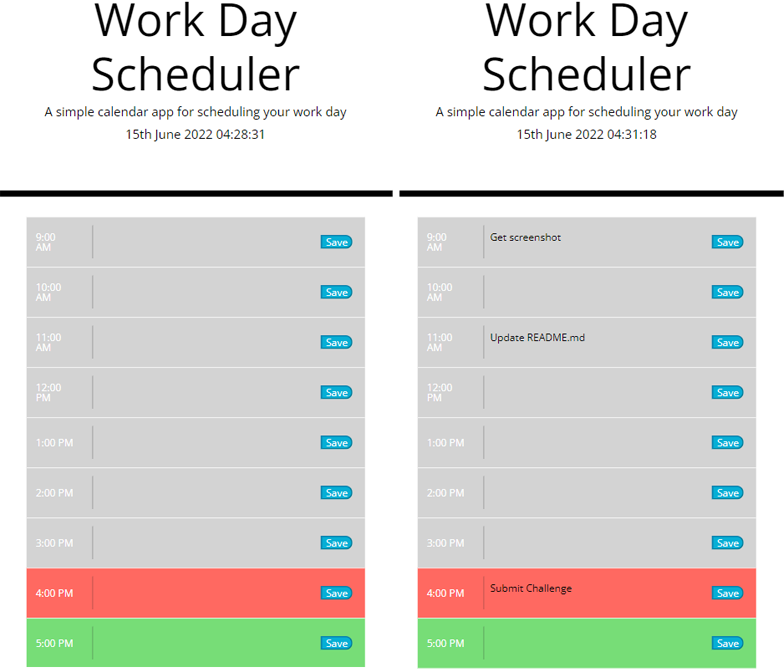

  # Workday Scheduler
  
  ## Table of Contents
  * [Description](#description)
  * [Technologies](#technologies)
  * [Installation](#installation)
  * [Usage](#usage)
  * [Contributing](#contributing)
  * [Guidelines](#guidelines)
  * [Tests](#tests)
  * [License](#license)
  * [Questions](#questions)
---

  ## Description
 Application designed to make organizing an average workday simpler by sorting todo tasks by time in a clear and intuitive UI. Features current date and live clock using moment.js. User simply clicks on desired time slot and enters information. Current time slot is displayed in red, while previous time is gray and future slots green. Information is saved to local storage and can be viewed throughout the day.
 

  ## Technologies
   * HTML
   * CSS
   * Bootstrap
   * JavaScript
   * JQuery
   
  ## Installation
   No installation required, visit the URL to use.

  ## Usage
   Application can be used [here](https://mleftwich.github.io/Scheduler/).

  ## Contributing
   If you'd like to contribute, reach out through the email listed below.

  ## Guidelines
  Can be used to facilitate any scheduling needs in an average 9-5 day.

  ## Tests
   Tests conducted in development.

  ## License
   Licensed under [MIT](https://opensource.org/licenses/MIT) 

   ---

  ## Questions
   For any questions you can find me at [GitHub](https://github.com/mleftwich) or email me at [mleftwich@live.com](mailto:mleftwich@live.com) 

